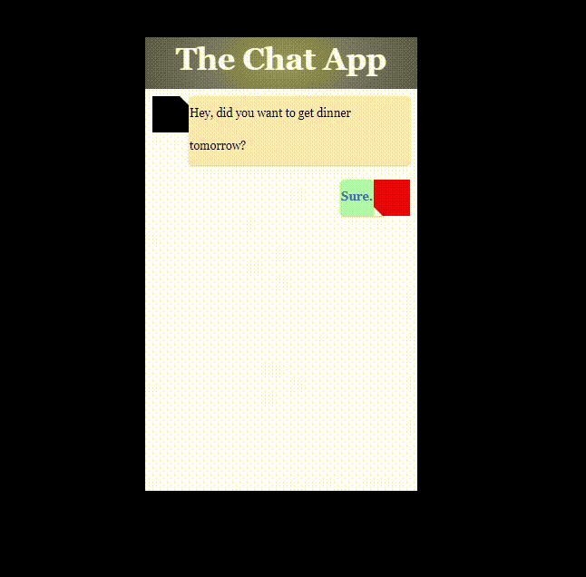

# Harlowe Chat App
A semi-interactive chat app for use in the Harlowe 3+ storyformat for Twine

## How to use:

`ChatDisplay.twee` contains the 2 passages that generate the chat flow, namely, ChatCycler and ChatResponse.
Passages Chat1 and Chat2 show some simple chat flow.

`ChatDisplay.twee` also has the CSS for the chat app embedded in it. `stylesheet.css` is provided as well.

## Variables:
All the variables this uses so you don't accidentally clash with variables from your existing story.
Obviously these can be changed, but at your own peril.

Variables this uses that likely require author interaction:
- $chatAppTitle: The name of the chat app e.g. Messenger
- $chatScriptArray: The script for the chat. Every odd entry is the player, every even entry is the other chat participant
- $dots: An array of characters to cycle through that symbolises the other person typing
- $playerAvatar: An HTML \ tag that includes the path to the image. 
- $otherAvatar: Same as $playerAvatar but for the other chat participant
- $pendingMessage: The message waiting for the player in the chat app. Can be set to 0 or "" to ignore

Variables this uses automatically:
- $dotPrint: How many dots to print
- |chat>: The chat hook where all the chat takes place
- $count: To cycle through the $dots
- |repeatingDots>: The hook where the $dots go 
- $rand: For generating how many $dots should be cycled through
- $message: The next message to be displayed

## Help?

Can be contacted on Twitter @ lockebirdsey

## Future improvements:
- Player choice in dialogue instead of just clicking to move the flow
- Better CSS